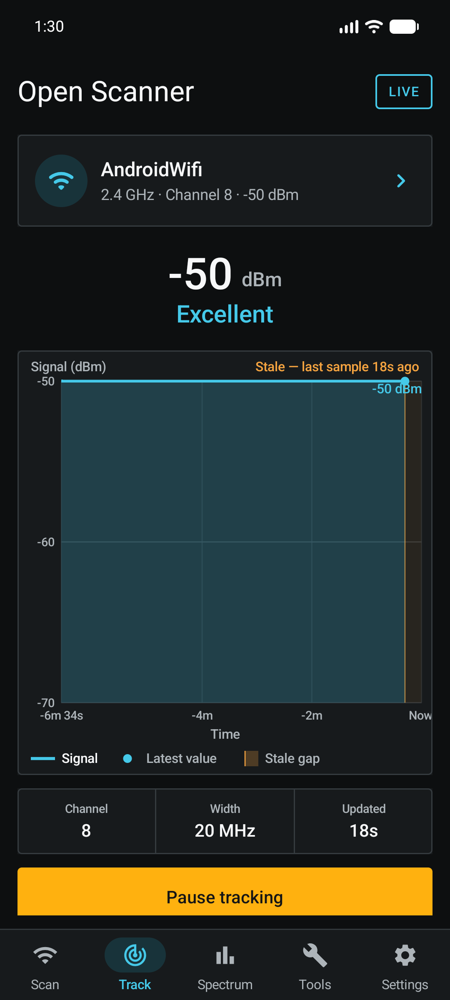

# Open Scanner

[English](README.md) | 简体中文

[](https://github.com/PROMCRdog/Open-Scanner/actions/workflows/ci.yml)

Open Scanner 是一款本地优先的开源 Android Wi-Fi 分析工具包。它将 Android 的被动扫描结果整理为清晰的五个标签页工作流：**扫描**、**追踪**、**频谱**、**工具**和**设置**。

0.1.0 版本是一个早期公开版本：自动化隐私/构建门禁、永久签名、逐构件精确校验以及范围受限的真机冒烟测试均已通过。它尚未获得广泛的 API 26–36 设备认证，也未通过人工无障碍/性能认证。保障级别与剩余验证项已公开于 [ADR 0003](docs/adr/0003-early-public-release-policy.md) 和[发布检查清单](docs/release/v0.1.0-checklist.md)。

界面遵循选定的深色 **Field Console** 设计方向。它优先考虑可读性、带标签的控件、明确的数据新鲜度以及如实呈现的不可用状态，而不是追求最大数据密度。备选设计中的信道频谱图则保留为独立的顶级标签页。



## 当前开发范围

- 单一应用级扫描协调器；各界面绝不创建相互竞争的扫描循环。
- 附近接入点清单，按信道验证分为 2.4、5.2、5.5/DFS、5.8、6 GHz 以及不支持频段分组。
- SSID、BSSID、信号强度、信道、频率、频宽、安全类型、Wi-Fi 代际，以及当 Android 提供连接证据时高亮显示当前系统已连接 Wi-Fi 的标记。
- 搜索、按信号强度优先排序、显式刷新、缓存/节流结果警告、只读的 Android 扫描节流状态，以及区分开的权限/Wi-Fi/位置/设备错误状态。
- 选中 AP 追踪器：按时间戳缩放、上限 60 个采样点、仅存在于内存的信号历史，并在最新证据不再是最新时显示可见的间隙。
- 基于近期快照的稳定性指标，直接报告 RSSI 波动范围和观测到的缺失占比，而不是要求用户从图表中自行推断信号抖动。
- 独立的 Canvas 频谱图，最多突出显示四个网络，并提供无障碍的等效文字描述；未知信道频宽保持明确显示为未知，而不会虚构出 20 MHz 的占用。
- 基于观测的同频/重叠分析，不会声称知晓合法的路由器信道或信道占用时长。
- 由 Android 提供的物理 Wi-Fi 连接验证、强制门户（captive portal）、链路速率、IP、网关和 DNS 证据，不混入蜂窝默认路由，也不探测外部服务器。
- 被动观测的周边环境概况：按信道组的观测计数、广播的安全类型以及报告的 Wi-Fi 代际。
- 全局屏幕隐私模式，通过 DataStore 持久化。
- 显式开始/停止的 Wi-Fi 会话日志，字段可选，报告脱敏方式在每个会话开始时即冻结。
- 默认脱敏的快照与 text/JSON/CSV 日志导出；启用未脱敏报告前有明确警告，每次分享前都有精确的内容确认预览。
- 临时导出使用 Android 的 URI 授权流程，在应用保持打开状态一小时后删除，或在之后的应用启动/导出时删除。
- 无账号、无广告、无遥测、无云服务、无分析 SDK，也不申请 `INTERNET` 权限。

## 安全与隐私边界

0.1 版本完全采用被动方式。它不加入网络、不收集密码、不探测局域网设备、不做测速、不扫描端口，也不联系任何互联网端点。加入网络和受保护设置由 Android 系统负责。

附近的 Wi-Fi 扫描可能暴露位置信息，因此 Android 要求精确位置权限，并且在许多版本上还要求打开系统位置开关。Open Scanner 不请求 GPS 坐标。原始扫描历史仅保留在内存中，随进程退出而消失。会话日志同样仅存于内存且有上限。报告脱敏默认开启：脱敏会话在日志记录产生之前就对 SSID、BSSID、精确时间戳和本地地址进行变换。用户可以显式允许未脱敏的报告；此后新的日志会话仅在内存中保留所选的原始字段。每次导出都会明确标注，并在分享临时文件前提供精确预览。

参见[威胁模型](docs/security/threat-model.md)和[功能边界](docs/product/full-toolkit-feature-set.md)。

## 构建

要求：

- JDK 17
- Android SDK Platform 36.1 和 Build Tools 36.0.0 或更新的兼容 36.x 工具
- 用于真机测试的 ADB

wrapper 和依赖版本均已锁定。在仓库根目录下：

通过 Android Studio 或标准的 `JAVA_HOME` 与 `ANDROID_HOME`
环境变量配置好 JDK 17 和 Android SDK Platform 36.1，然后运行：

```bash
./gradlew --dependency-verification=strict test :app:assembleDebug :app:assembleDebugAndroidTest
./gradlew --dependency-verification=strict :app:lintRelease :app:assembleRelease
```

仅在你自己控制的设备上安装 debug APK：

```bash
adb install -r app/build/outputs/apk/debug/app-debug.apk
```

部分小米/HyperOS 设备会额外要求在开发者选项中开启**通过 USB 安装**。Open Scanner 的构建不会绕过这一设备端的安全保护。

源码构建产生的是未签名的候选发布版。官方发布构件在发布时会通过维护者的私有流程签名。debug APK 仅用于本机设备 QA；绝不要将其作为正式版本分发。

## 项目结构

| 模块 | 职责 |
|---|---|
| `:app` | Compose UI、Activity、状态映射以及手动组装的应用对象图 |
| `:core:model` | 不可变的扫描、连接、能力与偏好模型 |
| `:core:domain` | 信道映射/分组、信号与稳定性分类、概况聚合、安全回退解析、新鲜度判断与重叠分析 |
| `:core:privacy` | 标识符掩码与隐私变换 |
| `:core:export` | 脱敏/未脱敏快照编码器、记录量有上限的 Wi-Fi 日志记录器，以及 text/JSON/CSV 日志编码器 |
| `:data:wifi-android` | Android API 适配器与唯一的扫描协调器 |
| `:data:settings` | 基于 DataStore 的本地偏好设置 |
| `docs/architecture/ui-design-system.md` | 令牌化的 UI 设计系统：颜色/字体/间距令牌、共享组件与图表约定 |

架构细节见 [docs/architecture/native-app.md](docs/architecture/native-app.md)。

## 已知限制

- Android 可能节流或复用 Wi-Fi 扫描结果；“刷新”只是一次请求，并不保证真的触发了射频扫描。
- RSSI 不代表距离、速度、占用情况、身份或安全性。
- 被动重叠分析不等于信道占用时长，也无法保证选出合法或最优的路由器信道。
- 硬件、系统版本、权限、接入点信标以及 OEM 行为决定了哪些字段可用。
- 会话日志不是持久保存的会话：它们随应用进程结束而消失，上限为 500 条状态记录或 25,000 行 AP 数据。
- PNG 导出、加密的保存会话历史/对比、别名/收藏、快照差异对比、演示模式、本地化、6 GHz PSC 高亮、主动 DNS/HTTP 测试、局域网发现以及吞吐量测试仍为未来工作。

## 贡献与安全

在公开开展工作之前，请先阅读 [CONTRIBUTING.md](CONTRIBUTING.md)、[GOVERNANCE.md](GOVERNANCE.md)、[SUPPORT.md](SUPPORT.md)、[CODE_OF_CONDUCT.md](CODE_OF_CONDUCT.md) 和 [SECURITY.md](SECURITY.md)。绝不要在 bug 报告中附上原始 SSID、BSSID、IP 地址或未脱敏的截图。

## 许可证

Apache License 2.0。详见 [LICENSE](LICENSE)。
