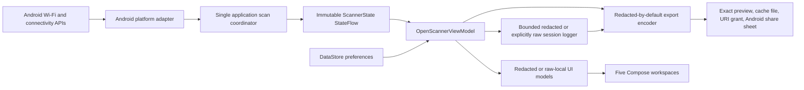

# Native Android architecture

## Data flow

`AndroidWifiScanRepository` is the only production class that calls `WifiManager.startScan()`, reads `scanResults`, or registers the scan-result receiver. It normalizes each result set on a background dispatcher, retains one immutable snapshot, and exposes it through `StateFlow`. Scan-result commits, pause/stop transitions, and invalidation generations share one lock so an in-flight worker cannot publish `LIVE` after scanning has been paused, stopped, or blocked.

The coordinator reuses a snapshot sequence when Android returns identical source timestamps/content. A false scan request, an explicitly non-updated broadcast, or reused content marks throttling as likely; it never claims certainty. Separately, the platform-capability adapter reads Android's persisted Wi-Fi scan-throttle switch through `WifiManager.isScanThrottleEnabled()` on API 30+ and the readable AOSP global setting on API 29. API 26–28 report that switch state as unavailable. The UI keeps this configured switch state distinct from observed likely-throttling evidence: an enabled switch does not prove that a particular request was throttled, and a disabled switch does not prove that every scan produced new results. Cached radio observations are kept separate from connection evidence: connection metadata and each row's connected marker are refreshed on every snapshot read. Evidence is taken from a physical Wi-Fi transport, never from a cellular default route or VPN transport. When Android exposes multiple non-default Wi-Fi transports, the adapter matches the platform-reported primary BSSID or uses the only candidate; it withholds connection evidence if the candidates remain ambiguous.

`OpenScannerViewModel` maps sensitive platform models into UI models. When Privacy Mode is enabled, names and addresses are transformed before Compose receives them. UI identifiers are short process-local hashes, not raw BSSIDs. Signal history is held only in the ViewModel, limited globally to the 128 most recently observed BSSIDs, 60 timestamp-deduplicated points per BSSID, and 30 minutes, and is never persisted. The existing elapsed-time clock prunes history even while scans are paused, and the chart window ends at real current time so stale or throttled evidence leaves a visible tail rather than being drawn at “Now.”

The same changed-snapshot stream retains at most 60 presence frames for the selected-AP stability summary. It reports the RSSI range and fraction of assessed snapshots in which the AP was absent; it ignores frames before the AP was first observed and withholds a label until enough evidence exists. The neighborhood posture summary is another pure transformation of the current snapshot.

Wi-Fi session logging is explicit and memory-only. The selected field set and report-redaction choice are frozen at start. A redacted session owns a random salt used to derive non-reversible in-memory alias keys; raw identifiers and exact wall-clock times are transformed before immutable log records are created. After the user explicitly enables unredacted reports, a new unredacted session retains the selected raw identifier/address fields in memory until clear, replacement, or process exit. The ViewModel records scanner-state changes and, while the scanner remains live in the foreground, samples the current state at the requested refresh cadence so cached/reused evidence still has an honest growing source age. Records include relative elapsed time and may include scanner phase, source age, AP/radio/security/generation fields, and Android connection/link/address evidence. The recorder stops at 500 state records or 25,000 AP rows.

Snapshot and log exports are complete `ExportDocument` values carrying an explicit redaction flag and previewed before sharing. Unredacted documents use conspicuous titles/filenames, a sensitive-data warning, and a dedicated **Share unredacted** confirmation. `MainActivity` writes only the approved payload to `cacheDir/exports`, shares it through a non-exported `FileProvider` and temporary read grant, and deletes it after one hour while the process remains alive or during a later app start/export. No storage permission is used.

## Dependency direction

- `app` depends on every lower module and Android framework UI APIs.
- Android data adapters depend on model/domain modules, never on UI.
- Domain, privacy, and export logic are JVM-testable and do not depend on Android.
- Snapshot export accepts a raw in-memory snapshot and applies the current report-redaction setting internally. Log export accepts a session whose redaction choice was frozen at recording start.

## UI layer

The Compose UI is built on the tokenized design system documented in [ui-design-system.md](ui-design-system.md): color, type, and spacing tokens from `OpenScannerTheme.kt`, shared components from `ui/components/Common.kt`, and charts from `ui/components/Charts.kt`. Charts are required to carry axis titles with units, computed ticks aligned to gridlines, and legends that identify series by text and shape rather than color alone. 11sp is the text floor throughout.

## Performance choices

- One normalization pass per accepted result event.
- Strength-first immutable lists and globally bounded histories.
- Compose `LazyColumn` for the access-point inventory.
- Canvas charts capped at 60 timeline samples and four emphasized spectrum series.
- DataStore writes only explicit preference changes; session logs never enter DataStore.
- No background scan service; the coordinator stops when the visible activity stops.
