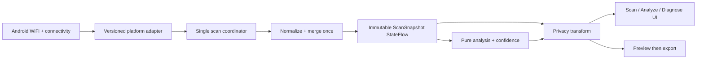

# Open Scanner: Open-Source Android Build Plan

Date: 2026-07-31
Status: historical implementation plan; accepted decisions and current source supersede proposed details

## 1. Product decision

Build a local-first WiFi analyzer for unmodified Android devices. Priority 1 is an intuitive, modern, accessible interface; priority 2 is high performance and energy efficiency.
The app must be honest about Android scan throttling, hardware gaps, missing regulatory data, and stale observations. Version 0.1.0 is passive: it makes no app-originated network requests; Android owns WiFi joining, credentials, captive-portal handling, and protected settings.

Source decisions are grounded in:

- `docs/product/full-toolkit-feature-set.md` for scope and safety boundaries;
- `docs/product/selected-design-direction.md` for the chosen visual direction;
- `docs/architecture/native-app.md` and the accepted ADRs for the implemented architecture.

Early comparative research informed the plan but is not distributed in the public repository. Public implementation decisions must be supported by repository documentation, tests, and primary platform sources.

Current platform anchors are Android's [WiFi scan guidance](https://developer.android.com/develop/connectivity/wifi/wifi-scan), [WiFi infrastructure overview](https://developer.android.com/develop/connectivity/wifi/wifi-infrastructure), [Android 17 LAN permission guidance](https://developer.android.com/privacy-and-security/local-network-permission), and [Google Play target API policy](https://support.google.com/googleplay/android-developer/answer/11926878?hl=en-GB_ALL).

## 2. Pre-initialization visual gate

Before any Gradle or Android project initialization, show exactly three grounded visual options using the same realistic dense Scan state, permission-denied state, dark mode, and 200% text sample:

1. **Calm Instrument** — light-first neutral surfaces, restrained blue accent, edge-to-edge list, compact evidence chips, and a chart that highlights one AP while muting context.
2. **Field Console** — dark-first high-contrast surfaces, stronger status bands, larger numeric signal readouts, and persistent pause/freshness controls for walking diagnostics.
3. **Adaptive Utility** — Material 3 dynamic shell, fixed accessible chart palette, roomier cards, and an adaptive bottom bar/navigation rail for phone and tablet.

Recommend **Calm Instrument**, because it best reduces the audited density and discoverability problems without making the app feel like a specialist-only console.
The product owner must select one option and record the annotated rationale in `docs/adr/0001-visual-direction.md`; project initialization is blocked until then, and the three directions must not be silently blended.

## 3. Information architecture

Use four icon-plus-text top-level destinations on phones and a navigation rail at widths of 600 dp or more:

| Destination | Primary question | v0.1.0 content |
|---|---|---|
| Scan | What is visible now? | AP inventory, search/filter/sort, band selector, AP detail |
| Analyze | How crowded or stable is it? | Spectrum, Timeline, Channels subviews |
| Diagnose | Is my current connection healthy? | connection evidence, signal/security status, reversible actions |
| Tools | How do I share or configure this? | export, privacy, settings, help, about/notices |

Global Privacy Mode, pause/resume, and freshness retain state across destinations. Band is a real 2.4/5/6 GHz segmented control, never a cycling icon; unsupported choices stay visible and disabled with a reason.
Secondary actions live in labelled menus or sheets, not a crowded icon toolbar; system back follows Android navigation with no double-back-to-exit behavior.

## 4. Core journeys

### First useful scan

1. Explain “processed only on this device” and what Android exposes; do not show a rating prompt.
2. Run a capability check before requesting permission.
3. Request only the permissions needed for the chosen capability, with a plain-language rationale.
4. If system Location or WiFi is off, show one direct system-settings action and retain an offline Help path.
5. Open Scan with a skeleton only while work is active, then a live snapshot or a specific unavailable state.

### Inspect and compare

1. Choose a supported band, then search, filter, group by SSID/security, or sort.
2. Select an AP to open a detail sheet; raw capabilities and identifiers are secondary.
3. Pin two to four BSSIDs for comparison; selection is synchronized between list, spectrum, and timeline.
4. Keep the connected AP first and labelled with text plus shape, not color alone.

### Assess a channel

1. Choose “Place a new AP” or “Assess connected AP,” band, and intended width.
2. Show one recommendation only when the legal candidate set is known.
3. Show ordinal suitability, confidence, age/sample count, inputs, omissions, and limitations.
4. If regulatory or evidence requirements fail, show “Insufficient information” plus relative observed congestion, not a router-setting instruction.

### Diagnose and export

1. Diagnose reads the exact same snapshot ID as Scan and Analyze.
2. Lead with connected AP, Android validation/captive state, signal class, security class, and link metadata availability.
3. Offer reversible steps: move closer, refresh, complete captive login, or open system WiFi settings.
4. Export opens a persistent preview, redacted by default, followed by the Android share sheet.
5. Raw export requires a second explicit switch and confirmation every time; completion alone uses a transient message.

## 5. Screen-state contract

Every destination renders one of these explicit states and exposes the same state through accessibility semantics:

| State | Presentation | Primary action |
|---|---|---|
| Checking | Short skeleton plus “Checking device” | none |
| Live | Snapshot ID, age, observed cadence | Pause |
| Paused | Persistent banner and increasing age | Resume |
| Aging | Amber-neutral freshness label, no alarm color alone | Refresh request |
| Stale | Results remain visible but recommendations are disabled | Retry/explain limits |
| Throttled likely | Explain reused timestamps and Android limits | Wait/use cached evidence |
| No APs | Empty illustration and current band | Change band/retry |
| Permission denied | Explain unavailable data without blame | Grant/open settings |
| Permission permanently denied | Retain Help, Settings, notices | Open app settings |
| System Location off | Explain platform dependency | Open Location settings |
| WiFi off | No fake results | Open WiFi settings |
| Unsupported band | Disabled segment with device reason | Choose supported band |
| Platform error | Preserve last safe snapshot, redact diagnostics | Retry/copy safe error code |

Changing screens never restarts scanning or clears pause; changing band filters the shared snapshot and clears only band-specific visual selection, not global history without confirmation.

## 6. UI and accessibility system

- Use Compose Material 3 components, edge-to-edge layout, light/dark themes, and adaptive phone/tablet layouts.
- Use the selected visual option for surfaces and hierarchy; data colors come from a fixed tested palette, not dynamic color.
- Use an 8 dp layout grid, minimum 48 x 48 dp targets, 16 sp body text, and no essential text below 12 sp.
- Meet at least 4.5:1 text and 3:1 non-text contrast; validate light, dark, high-contrast, and color-vision-deficiency simulations.
- At 200% font scale, values wrap or reflow; controls and warnings must not clip or overlap.
- Every action has label, role, enabled/selected state, tooltip, keyboard focus order, and switch-access behavior.
- Announce permission, band, pause, error, and freshness transitions; never announce each RSSI sample.
- Charts use color plus dash pattern, marker, line weight, and synchronized legend identity.
- Render at most four emphasized AP series; mute aggregate context and virtualize the searchable selector.
- Give every chart a text summary containing selected AP, latest/min/max RSSI, trend, channel, age, and gaps.
- Use dBm by default; optional percentage is explicitly called a mapping, never a more accurate measurement.
- Motion is functional, 200 ms or less, removed when system animation/reduced-motion settings request it, and never flashes.
- Haptic/audio feedback is absent from v0.1.0; later tracker feedback must always have visual and silent alternatives.
- Persistent sheets confirm export reset/delete/raw-share actions; snackbars report completed reversible actions only.

## 7. Android platform and permission strategy

- Set `minSdk = 26`, stable `compileSdk = 36`, and `targetSdk = 36` for v0.1.0. This meets the Android 16 Play requirement beginning 2026-08-31 without basing the first release on the Android 17 preview toolchain.
- Add a non-release API 37 compatibility lane once its preview SDK is installed. Move compile/target SDK to 37 only after the SDK and compatible AGP are stable, the physical-device matrix passes, and an ADR records the behavior change.
- Pin Gradle to the already available JDK 17 LTS and compile Kotlin/Java to JVM 17 bytecode; enable core-library desugaring only if used.
- Support phones and tablets; do not add Wear, TV, Auto, or Chromebook-specific promises in v0.1.0.
- Declare `ACCESS_WIFI_STATE` and `CHANGE_WIFI_STATE` for scan state/results and explicit foreground scan requests.
- Declare and request `ACCESS_FINE_LOCATION` where Android requires it for `startScan()`/`getScanResults()`; explain that scans can reveal location context.
- On API 33+, request `NEARBY_WIFI_DEVICES` only for a connection-information API path that actually requires it; denial degrades that metadata, not the AP inventory.
- Do not declare `INTERNET`, background location, storage, notification, VPN, usage-access, or `ACCESS_LOCAL_NETWORK` in v0.1.0.
- On API 37+, LAN tools remain unavailable because broad local access is outside v0.1.0; a later target-37 module must add runtime `ACCESS_LOCAL_NETWORK` only at point of use.
- Use a versioned `PlatformCapabilities` adapter for API 26–28, 29–32, 33–36, and 37+ behavior.
- Treat every API field, WiFi generation, width, security type, MLO link, IP, DNS, and link speed as optional.
- Expose scan throttling as a read-only Android setting, distinct from observed cached-result evidence. A Settings hint may point to the Developer Options override for local testing, but must state that disabling it can increase scan frequency and battery use and must not present it as the default operating mode.
- Stop scan requests when the process is not foreground-visible; explicit future sessions require a separate foreground-service design review.

## 8. Kotlin and Jetpack Compose stack

- Kotlin-only source with explicit API mode for reusable core modules.
- Jetpack Compose Material 3, Navigation Compose, Activity Compose, Lifecycle ViewModel, SavedState, and `collectAsStateWithLifecycle`.
- Coroutines and `StateFlow` for the one-way state pipeline; no RxJava and no parallel screen-owned timers.
- Manual constructor injection through an application graph; avoid DI code generation until module count or test friction proves a need.
- AndroidX DataStore for preferences; Keystore-backed cryptography for persistent identifier keys.
- Kotlinx Serialization for versioned JSON export; a streaming writer for CSV; Compose Canvas for charts and PNG rendering.
- WorkManager only for guaranteed temporary-export cleanup; it must never schedule scans.
- AndroidX Benchmark/Macrobenchmark and Baseline Profiles for measured startup, scroll, and chart performance.
- JUnit, kotlinx-coroutines-test, AndroidX Test, Compose UI tests, and Gradle Managed Devices.
- Use no ad, analytics, account, cloud, crash-upload, proprietary chart, or closed-source SDK.
- Centralize every dependency and plugin in `gradle/libs.versions.toml`; prohibit dynamic and version-range dependencies.
- At initialization, pin the current stable compatible AGP, Kotlin, Compose BOM, and AndroidX versions as one tested set; record them in an ADR instead of guessing future compatibility here.

## 9. Module boundaries

| Module | Responsibility |
|---|---|
| `:app` | activity, navigation, application graph, build variants |
| `:core:model` | immutable sensitive and redacted domain types |
| `:core:domain` | channel mapping, overlap, confidence, diagnostic rules |
| `:core:privacy` | HMAC identities, redaction, safe logging, leak guards |
| `:core:designsystem` | theme, components, chart tokens, accessibility helpers |
| `:core:export` | preview model, CSV/JSON/PNG encoders, metadata stripping |
| `:core:testing` | fixtures, fake clocks, fake platform data, assertions |
| `:data:wifi-android` | API adapters, receiver/callback, scan coordinator, connection merge |
| `:data:settings` | DataStore preferences, aliases, favorites, migrations |
| `:feature:scan` | AP inventory, filters, groups, detail sheet |
| `:feature:analyze` | spectrum, timeline, channel assessment |
| `:feature:diagnose` | connection evidence and troubleshooting rules |
| `:feature:tools` | export entry, settings, help, notices |
| `:benchmark` | macrobenchmarks and baseline-profile generation |

Features depend on core interfaces, never directly on Android WiFi APIs or another feature.
Keep pure rules in JVM-testable modules; confine framework, permission, clock, and filesystem effects to adapters.

## 10. One-scan data pipeline

The application-scoped coordinator alone may call `startScan()` or register callbacks; it merges scan results, `WifiInfo`, network capabilities, link properties, permissions, and a monotonic clock once per result event.
It deduplicates broadcasts by platform result timestamp/content hash and never invents a snapshot for reused data. A false `startScan()`, unchanged timestamps across two requests, or delayed callbacks supports “throttled likely,” not certainty.
UI refresh means “request/reevaluate,” never a promised radio scan. Normalization and analysis run on `Dispatchers.Default`; callback capture and StateFlow publication stay short and non-blocking.
Retain the latest snapshot and at most 600 points per selected BSSID, four selected BSSIDs, and 30 minutes; unselected APs keep only their latest observation and process exit clears history.

## 11. Domain model and algorithms

Core types are `ScanSnapshot`, `AccessPointObservation`, `RadioLink`, `ConnectionEvidence`, `PlatformCapabilities`, `Freshness`, `DiagnosticFinding`, `ChannelAssessment`, `Confidence`, and `Limitation`.
`ScanSnapshot` holds a monotonic sequence ID, wall/elapsed time, source result timestamps, requested/observed cadence, support states, and immutable observations. Missing, redacted, unsupported, and permission-blocked values remain distinct.
Sensitive types stringify to a redacted token, never raw SSID/BSSID/IP. In-process AP identity is normalized BSSID; persisted identity is `HMAC-SHA256(Keystore install key, normalized BSSID)`.

Frequency-to-channel conversion is table/range driven, accepts only exact valid centers, handles 2.4 GHz channel 14 and 6 GHz 5935 MHz explicitly, and maps malformed/future values to `Unknown(frequencyMHz)`.
Map structured Android security types before capability strings and preserve unknowns. Derive footprints from observed center/width; unknown width supplies only co-channel evidence and lowers confidence.

For candidate channel `c`, compute observed overlap cost as:

`cost(c) = sum(10^(RSSI_i/10) * overlapHz(c, i) / candidateWidthHz)`.

Clamp RSSI before conversion and exclude only the connected BSSID in connected-AP mode. Lower cost means less observed overlap, not guaranteed throughput or airtime utilization.
Present fixture-calibrated `Poor / Crowded / Fair / Clear` bands without decimal precision. Candidates come only from an OS allowed set or a user-supplied regulatory profile with provenance.
Without either candidate source, show relative congestion and “Insufficient regulatory information,” never a configure-channel recommendation.

Confidence is `Insufficient`, `Low`, `Medium`, or `High`, taking the minimum of freshness, distinct samples, metadata completeness, target-width certainty, and regulatory certainty.
Medium needs three distinct timestamps in five minutes and 80% known widths among material interferers; High needs five in ten minutes, known target width, a sourced allowed set, and a stable winner across three snapshots.
A stale snapshot, unknown legal set, or missing target width makes a recommendation `Insufficient`, with failed factors listed. Fresh is age `<= max(90 s, 2 x observed median cadence)`; stale is `> max(5 min, 4 x observed median cadence)`; between is aging.
Signal guidance is band/trend aware but states that RSSI is not distance, throughput, occupancy, identity, or safety.

## 12. Privacy and threat model

Protect raw SSIDs, BSSIDs, IPs, timestamps, aliases, favorites, connection metadata, exports, and the HMAC key. In-scope threats are accidental sharing, logs/crashes, backups, clipboard/URI leakage, malicious dependencies, stale files, screenshots, and bug reports.
Out of scope are a rooted OS, physical access to an unlocked device, radio-level anonymity, and recipients retaining an approved raw export.

- Local display may show real identifiers because v0.1.0 processes them only on-device, while a visible one-tap Privacy Mode aliases/masks them before UI models and semantics. Report redaction is a separate, default-on setting.
- Redaction happens before Compose models and semantics when Privacy Mode is on, and before logging/export payloads when report redaction is on. Disabling report redaction requires explicit consent and does not affect production logs, crash data, or telemetry.
- Use aliases `Network 1...n`, mask BSSID/IP, coarsen timestamps, and remove location-adjacent metadata.
- Production logging is event-code-only; debug logging uses synthetic fixtures and the same safe logger.
- Set `allowBackup=false` and restrictive data-extraction rules for sensitive stores; disable cleartext traffic.
- Use app-private storage, non-exported components, narrow FileProvider paths, one-time URI grants, and no broad filesystem permission.
- Keep clipboard copy behind a labelled action, redact by default, mark content sensitive where Android supports it, and warn before raw copy.
- Generate the install HMAC key in Android Keystore; deleting local data deletes the key and makes old identifiers unlinkable.
- Keep dependencies on a license/need allowlist and verify artifacts; run release APK permission and endpoint scans.
- Publish `docs/security/threat-model.md` and `SECURITY.md` before the first release.

## 13. Storage and export

Version 0.1.0 persists settings, the install key, hashed-key aliases/favorites, and consent only; snapshots/timelines are RAM-only. Typed DataStore schemas migrate forward and offer safe deletion on corruption.
Defer Room until saved sessions, which require explicit start/stop, retention, encryption, and migration tests.
CSV/JSON use a versioned schema with units, age, missing reasons, algorithm version, confidence, and limitations. PNG uses a fixed-layout renderer with evidence footer/legend, never a UI screenshot.
Generate a redacted preview by default; raw inclusion creates a conspicuously labelled preview and requires a dedicated share confirmation. Write to `cacheDir/exports`, strip metadata, share via FileProvider, and delete within one hour plus next-launch cleanup.
Delete-all clears DataStore, cached exports, RAM history, and the Keystore key, then reports what was removed.

## 14. Performance and efficiency budgets

Measure on a documented 4 GB mid-tier reference phone and the audited high-density Android 16 device; report medians and p95 over at least 20 runs.

| Budget | Release threshold |
|---|---|
| Cold start to usable shell | p50 <= 700 ms; p95 <= 1,200 ms |
| Snapshot normalization, 200 APs | p95 <= 50 ms; no main-thread disk or analysis work |
| Scan list scroll | >= 95% frames <= 16.7 ms; no frame > 50 ms in benchmark |
| Four-series chart update, 600 points each | p95 <= 16 ms CPU; <= 1 update per snapshot |
| Warm app memory, 200 APs/history bound | <= 120 MiB RSS |
| Paused/background CPU | < 1% and zero scan-request timers/wake locks |
| Active foreground between callbacks | < 2% CPU outside render interaction |
| 30-minute analysis battery delta | <= 4% above screen-on control on reference device |
| 200-row PNG/JSON/CSV export | p95 <= 2 s; <= 32 MiB transient heap growth |
| Release universal APK | <= 15 MiB before signing; track AAB download estimate |

Benchmark synthetic sets of 0, 50, 200, and 1,000 APs, malformed fields, duplicate broadcasts, and 30-minute histories.
Use immutable collections at publication boundaries, stable Compose keys, derived state, list virtualization, cached text measurement, and Canvas path reuse.
Profile before adding caches; every cache has an owner, bound, invalidation rule, and benchmark evidence.

## 15. Test strategy

- Pure unit fixtures cover 2.4/5/6 GHz mappings, channel widths, center frequencies, unknowns, security families, MLO absence/presence, signal classes, and freshness boundaries.
- Golden algorithm fixtures expose all inputs and verify ranking, connected-BSSID exclusion, ordinal mapping, confidence caps, ties, and insufficient-information outcomes.
- Property tests check determinism, input-order independence, monotonic overlap cost, finite numeric results, and no recommendation outside the allowed set.
- Privacy tests seed recognizable SSID/BSSID/IP canaries and scan UI models, semantics trees, logs, DataStore bytes, CSV, JSON, PNG metadata/text, and temp filenames for leakage.
- Coroutine tests use fake monotonic/wall clocks and prove one coordinator, deduplication, pause persistence, cancellation, and no per-screen scan loop.
- Compose tests cover every screen state, 200% text, RTL, dark/high-contrast themes, keyboard focus, selected roles, and equivalent chart summaries.
- Instrumentation tests exercise permission denial, permanent denial, Location off, WiFi off, unsupported band, process recreation, rotation, and API-specific adapters.
- Macrobenchmarks enforce startup, 200-row scrolling, filter/search, chart updates, navigation, and export budgets.
- Static gates run Android Lint, Detekt, Ktlint, dependency verification, forbidden-network/permission checks, and OSS license checks.
- Fuzz parsers and export serializers with malformed capability strings, Unicode SSIDs, hidden networks, extreme RSSI, duplicates, and oversized scans.
- Emulators validate deterministic UI and API branches; physical devices are authoritative for WiFi, permissions, throttling, power, and OEM behavior.

## 16. CI, reproducibility, licensing, and governance

Every-change CI runs static analysis, JVM tests, debug/instrumentation builds, privacy scan, release build, benchmark smoke test, and notices/SBOM; nightly adds full API 26/29/33/36 devices, API 37 when its compatible SDK image is available, and reproducibility audits.
Pin the wrapper checksum, JDK, Android SDK/build tools, plugins, dependencies, and CI image; enable dependency verification/locking and archive the graph, CycloneDX SBOM, mapping, checksums, and build manifest.
Build unsigned artifacts twice in clean offline containers with the same `SOURCE_DATE_EPOCH`; byte differences block release for diffoscope analysis.
Then sign and publish signed/unsigned checksums, source tag, toolchain manifest, and verification instructions. Release only from a clean signed tag with no secrets, private identifiers, screenshots, machine paths, or `local.properties`.

License original code/docs under Apache-2.0 and retain third-party notices. Allow Apache-2.0/MIT/BSD/ISC dependencies by default; copyleft or unavailable source needs a recorded legal/architecture decision.
Use DCO sign-off, not a CLA; publish contribution, conduct, security, support, issue/PR, and ADR guidance.
Require one maintainer approval normally and two for permissions, privacy, cryptography, exports, scoring, signing, or dependency-source changes.
Use coordinated security disclosure and never claim a network is “safe” from scan evidence alone.

## 17. China Gradle/Maven fallback

Google Maven, Maven Central, and Gradle services remain canonical. Provide an opt-in `china-mirror` init profile, never automatic switching or different versions.
Map Google, Central, and plugin coordinates to Aliyun `google`, `central`, and `gradle-plugin` with exclusive filters; allow organization mirror URLs without editing project declarations.
Mirrored artifacts must match committed verification metadata or fail closed. For Gradle, fetch the pinned ZIP from any reachable mirror, verify `distributionSha256Sum`, and seed `GRADLE_USER_HOME/wrapper/dists` without changing the wrapper URL.
Document cache warming plus `./gradlew --offline`; CI tests official sources per change and mirror/offline nightly, requiring identical locks, SBOM, and outputs.

## 18. Milestones and incremental local Git commits

Each milestone ends buildable, tested, and reviewable; create small local commits after each green slice and do not push automatically.

| Milestone | Exit result | Planned local commit sequence |
|---|---|---|
| M0 Visual gate | three options reviewed; one selected; ADR accepted | `docs: record visual direction and UI state contract` |
| M1 Reproducible shell | pinned project, convention plugins, CI, themes, nav | `build: initialize pinned Android project`; `feat: add adaptive accessible shell` |
| M2 Scan truth | permission adapter, one coordinator, immutable snapshot, fakes | `feat: add versioned wifi platform adapter`; `feat: publish unified scan snapshots` |
| M3 Scan UI | states, segmented bands, list, detail, search/filter/group | `feat: build privacy-safe scan inventory`; `test: cover scan states and accessibility` |
| M4 Analysis | spectrum, timeline, channel algorithm and confidence | `feat: add bounded accessible charts`; `feat: add explainable channel assessment` |
| M5 Diagnose | current-connection evidence and system-owned actions | `feat: add passive connection diagnostics` |
| M6 Privacy/export | aliases, favorites, redaction preview, CSV/JSON/PNG | `feat: enforce privacy boundary`; `feat: add expiring redacted exports` |
| M7 Hardening | benchmarks, device matrix, docs, SBOM, reproducibility | `perf: meet release budgets`; `docs: publish threat model and limitations` |
| M8 v0.1.0 | signed, reproducible, installed release candidate passes gates | `chore: prepare 0.1.0 release` |
| M9 Post-MVP passive | explicit saved sessions, comparison, BSSID tracker, survey | separate minor releases and permission/privacy ADRs |
| M10 Opt-in active tools | DNS/TCP/local throughput/LAN tools with consent | separate modules; API 37 LAN permission and traffic review |

Never mix mass formatting, dependency upgrades, generated baselines, and behavior changes in one commit.
Before each commit run the narrowest relevant tests; before each milestone run `check`, affected instrumentation, and a clean assemble.

## 19. Connected-device QA and release gates

Cover API 26/28, 29/32, and 33/36 on real devices, including legacy 2.4 GHz and 6 GHz hardware. Always include the audited 1440 x 3200, 600 dpi Android 16 class; keep API 37 in the preview compatibility lane until stable hardware/images are available.
For every RC test fresh install/upgrade, reboot/process death, rotation/multi-window, dark, RTL, 200% text, TalkBack, Switch Access, and reduced motion.
Exercise permission grant/denial/revocation, Location/WiFi/airplane states, unsupported bands, no/dense APs, throttled, aging, stale, and paused states.
Verify one snapshot ID/time everywhere, persistent pause, no fake live values for vanished APs, and correct 6 GHz selection/ranges.
Record 30-minute foreground and paused/background Perfetto/Battery Historian runs against baseline; inspect redacted/raw exports, URI grants, metadata, and expiry.
The installed manifest must lack Internet/LAN/background-location/storage/VPN/notification/usage permissions; external capture must find no app network traffic.
Manually run TalkBack through every action and chart summary; automation supplements but never replaces this pass.

Release is blocked unless unit/instrumentation/benchmark/privacy tests pass, budgets pass, two physical-device classes pass, and known OEM exceptions are documented.
README, in-app Help, permissions table, threat model, algorithms, screenshots, notices, SBOM, and observable behavior must agree.
The signed release must install over the prior version, migrate data, delete all local data correctly, reproduce from the source tag, and match published checksums.

## 20. v0.1.0 definition

Version 0.1.0 ships Scan, Analyze, Diagnose, and Tools on stock Android API 26–36 with adaptive, accessible light/dark UI, plus a non-release API 37 compatibility lane.
It supports exposed 2.4/5/6 GHz data; AP list/detail, grouping, search/filter/sort, aliases/favorites, spectrum, bounded timeline, and explainable channel assessment are complete.
It exposes capability, permission, cadence, pause, age, throttling, stale/unsupported/missing data, confidence, and regulatory unknowns. Diagnostics stays passive; expiring PNG/CSV/JSON exports are previewed and redacted by default.
It stores no scan history, has no Internet/LAN permission, telemetry, ads, account, or WiFi passwords, and delegates joining to Android.
Saved sessions, tracker/survey, OUI, widgets, notifications, active/LAN tools, RTT, VPN, root, and external radio are later or excluded; unsafe offensive features and claims stay permanently excluded.

## 21. Principal risks and mitigations

| Risk | Decision |
|---|---|
| Android scan throttling makes “live” look broken | show observed cadence/age, deduplicate, cache honestly, never run screen timers |
| Permission behavior changes by API/OEM | versioned adapter, degraded fields, connected matrix, capability-first UI |
| Regulatory data is unavailable | withhold configuration advice; show relative congestion and failed confidence factor |
| Dense RF environments overload UI/GPU | virtualized list, four emphasized series, bounded history, stress benchmarks |
| Raw identifiers escape through hidden paths | sensitive types, redaction before models/semantics/export, canary leak tests, no telemetry |
| Security parsing becomes stale | structured APIs first, fixtures by API level, explicit unknown, no “safe network” claim |
| Recommendation looks more certain than evidence | ordinal output, minimum-factor confidence, visible inputs/limitations, golden fixtures |
| Mirrors or dependency updates compromise supply chain | opt-in mirrors, checksum verification, locks, SBOM, two-reviewer sensitive changes |
| Modular build becomes slow or ceremonial | keep interfaces narrow, use convention plugins, measure configuration time, merge modules only with evidence |
| Open-source release leaks test-environment networks | synthetic fixtures only, repository secret/identifier scan, clean-source release rehearsal |

Implementation may begin only after the visual gate; release may occur only after the connected-device, privacy, performance, accessibility, and reproducibility gates all pass.
